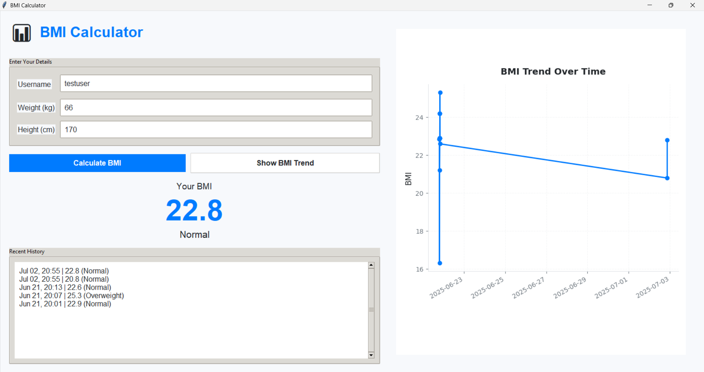

# BMI Calculator

A modern, user-friendly BMI (Body Mass Index) calculator application with data visualization, built with Python and Tkinter.



## Features

- **User-Friendly Interface**: Clean, intuitive design with a two-panel layout
- **BMI Calculation**: Instantly calculate your BMI based on weight and height
- **Trend Analysis**: Visualize your BMI history with an interactive chart
- **Data Persistence**: Your BMI history is saved locally for future reference
- **Responsive Design**: Adapts to different window sizes for optimal viewing

## Prerequisites

- Python 3.8 or higher
- pip (Python package manager)

## Installation

1. Clone the repository:
   ```bash
   git clone https://github.com/Joel-Shibu/BMI_Calculator
   cd BMI-Calculator
   ```

2. Install the required dependencies:
   ```bash
   pip install -r requirements.txt
   ```

## Usage

1. Run the application:
   ```bash
   python bmi_app.py
   ```

2. Enter your details:
   - Username (to track your history)
   - Weight in kilograms (kg)
   - Height in centimeters (cm)

3. Click "Calculate BMI" to see your results
4. View your BMI trend over time in the right panel

## Features in Detail

### Input Panel (Left)
- **User Information**: Enter and track multiple users
- **Real-time Calculation**: Get instant BMI results
- **History Log**: View your last 5 BMI calculations
- **Category Indicator**: Color-coded BMI categories

### Chart Panel (Right)
- **Interactive Graph**: Visualize your BMI trend over time
- **Responsive Design**: Automatically adjusts to window size
- **Data Points**: Clear markers for each BMI entry

## BMI Categories

- **Underweight**: BMI < 18.5
- **Normal weight**: 18.5 ≤ BMI < 25
- **Overweight**: 25 ≤ BMI < 30
- **Obese**: BMI ≥ 30

## Project Structure

```
bmi-calculator/
├── bmi_app.py          
├── requirements.txt    
├── README.md         
└── data/               # User data storage (automatically created)
    └── users.json     
```

## Dependencies

- Python 3.8+
- Tkinter (included with Python)
- Matplotlib
- Pillow (PIL)

